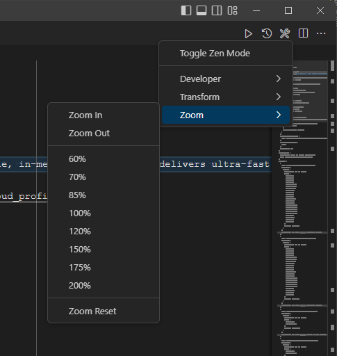

# vscode-source-surge

## Overview

Source Surge is an innovative and highly beneficial vscode extension designed to optimise developers' workflow by providing quick and easy access to a range of essential features. The extension was created to enhance productivity and reduce the cognitive burden of remembering multiple shortcut bindings.

The features provided by Source Surge are extensive and can be divided into three main categories: developer features, transformation features, and zoom features. The developer features have been designed to allow developers to execute everyday tasks quickly and without navigating through multiple menus or recalling specific keybindings. This dramatically streamlines the development process and enables developers to work more efficiently.

The transformation features provided by Source Surge are highly effective and enable developers to manipulate code easily. The ability to make changes on the fly is a crucial aspect of the development process, and the transformation features provided by Source Surge make this process significantly more efficient. This reduces the time and effort required to perform these tasks and allows developers to focus on the creative aspects of their work.

The zoom features provided by Source Surge are also highly beneficial and provide quick access to zooming in and out of code. This is particularly useful for developers who use high-resolution displays as it enables them to zoom in on code and see it in greater detail. In addition, this feature is highly beneficial for developers working on complex code and needing to focus on specific sections of their work.

Source Surge is a highly beneficial tool for developers who use VSCode as their code editor. The extension streamlines the development process and enhances the overall experience of using VSCode. The quick access to essential features, combined with the ability to manipulate code efficiently and zoom in and out of principle, makes Source Surge an indispensable tool for developers. Whether you are working on a small or large project, Source Surge will help you to be more productive, reduce the cognitive load of remembering multiple shortcut bindings, and, ultimately, make your work more enjoyable.

## **How can I help?**

If you enjoy using the extension, please give it a rating on the [Visual Studio Marketplace](https://marketplace.visualstudio.com/items?itemName=AndrewButson.vscode-jwt-decoder).

Should you encounter bugs or if you have feature requests, head on over to the [GitHub repo](https://github.com/arbs-io/vscode-jwt-decoder) to open an issue if one doesn't already exist.
Pull requests are also very welcome since I can't always get around to fixing all bugs myself.

This is a personal passion project, so my time is limited.

Another way to help out is to [sponsor me on GitHub](https://github.com/sponsors/arbs-io).

## **Copyright**

Copyright: Andrew Butson.

Licensed under the MIT License
