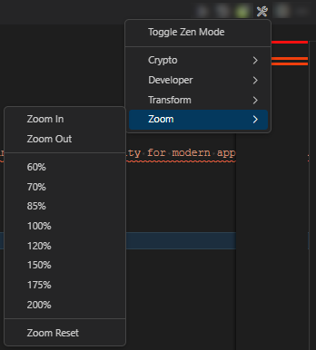
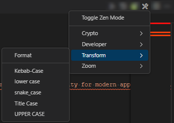
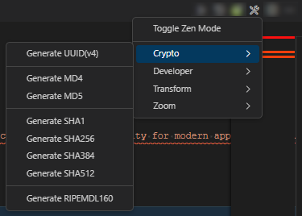
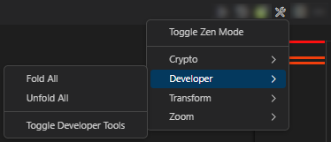

# vscode-source-surge

## Overview

Source Surge is a highly beneficial tool for developers who use VSCode as their code editor. The extension streamlines the development process and enhances the overall experience of using VSCode. The quick access to essential features, combined with the ability to manipulate code efficiently and zoom in and out of principle, makes Source Surge an indispensable tool for developers. Whether you are working on a small or large project, Source Surge will help you to be more productive, reduce the cognitive load of remembering multiple shortcut bindings, and, ultimately, make your work more enjoyable. The developer features have been designed to allow developers to execute everyday tasks quickly and without navigating through multiple menus or recalling specific keybindings. This dramatically streamlines the development process and enables developers to work more efficiently.

## Zoom

The zoom features provided by Source Surge are also highly beneficial and provide quick access to zooming in and out of code. This is particularly useful for developers who use high-resolution displays as it enables them to zoom in on code and see it in greater detail. In addition, this feature is highly beneficial for developers working on complex code and needing to focus on specific sections of their work.

### Precision Zoom

- Zoom In: Small adjustment to increase the size of vscode zoom

- Zoom Out: Small adjustment to decrease the size of vscode zoom

### Percentage Zoom

- Percentage: predefined sizes to adjust vscode ide, quickly

### Reset Zoom

- Reset: Reset the zoom to the original value (he initial value when vscode was opens)

## Transform

Quickly transform selected text in the active TextEditor. Changing case or formatting the document.

### Document Formatting

- Format: Formats the document open in the active editor. Note: formatting requires the document type to have a formatter installed.

### Document Case

These are some of the commonly used case types in naming conventions, and the choice of which one to use depends on the specific use case and the coding style guidelines followed by the development team.

- Snake case: Snake case is a naming convention where each word is separated by an underscore (\_) and all characters are in lowercase. For example: "first_name".

- Upper case: Upper case refers to writing all characters in capital letters. For example: "FIRST NAME".

- Lower case: Lower case refers to writing all characters in lowercase letters. For example: "first name".

- Title case: Title case is a capitalization style where the first letter of each word is capitalized, except for certain words (such as "of", "and", etc.). For example: "First Name".

- Kebab case: Kebab case is a naming convention where each word is separated by a hyphen (-) and all characters are in lowercase. For example: "first-name".

## Crypto

Generate new uuid/guid or hash the text in the active TextEditor, or a selectioned portion of the text. Each of these hash functions can be used to produce a digital signature or to verify the authenticity and integrity of data transmitted over an insecure channel. The choice of hash function will depend on the specific security requirements and computational resources available.

### UUID

UUID (Universally Unique Identifier) is a standardized way of generating unique identifier values for entities in a distributed computing environment. It's a 128-bit number, represented as 32 hexadecimal digits, that is used to identify resources in a unique and consistent manner.

### MD4 and MD5

MD4 and MD5 are two message-digest algorithms that are used to produce a fixed-length string of characters, called a "hash", from a variable-length input message. Both MD4 and MD5 are examples of hash functions that were once widely used but have since been found to be vulnerable to attacks and are no longer considered secure. In practice, it's important to use stronger, more secure hash functions such as SHA-256 or SHA-3 for cryptographic applications.

- MD4: designed by Ron Rivest in 1990 and is a 128-bit hash function that generates a 16-byte message digest. It was widely used for a variety of applications, but is now considered insecure due to various cryptographic attacks that have been discovered.

- MD5: MD5 is a successor to MD4, designed by Ron Rivest in 1992, and is a 128-bit hash function that generates a 16-byte message digest. It was widely used for security applications, but has since been found to be vulnerable to collision attacks, which can result in two different inputs producing the same hash value. As a result, MD5 is no longer considered secure for many cryptographic applications and its use is discouraged.

### SHA (Secure Hash Algorithm)

is a family of cryptographic hash functions widely used to secure data transmission. Here's a summary of the four commonly used hash functions in the SHA family:

- SHA-1: is a 160-bit hash function, which generates a 20-byte (160-bit) message digest. It is considered less secure than other SHA variants and is not recommended for use in new applications.

- SHA-256: is a 256-bit hash function, which generates a 32-byte (256-bit) message digest. It is more secure than SHA-1, but slower in terms of performance.

- SHA-384: is a 384-bit hash function, which generates a 48-byte (384-bit) message digest. It provides higher security than SHA-256, but at the cost of increased computational complexity.

- SHA-512: is a 512-bit hash function, which generates a 64-byte (512-bit) message digest. It is the most secure SHA variant and is used in applications where high security is a requirement.

### RIPEMD

The hash function takes an input message of any length and generates a 160-bit (20-byte) message digest that represents the input message. The message digest is a fixed-length, compact representation of the input data, and can be used for various purposes, such as verifying the integrity and authenticity of data transmitted over an insecure channel, or generating digital signatures. Compared to SHA-1, RIPEMD-160 has a longer message digest and is considered to be more secure. However, it is not as widely used as other hash functions such as SHA-256 or SHA-3. Despite this, RIPEMD-160 is still considered a strong and secure hash function and is used in a number of applications, such as the generation of Bitcoin addresses.

- RIPEMD-160 is a 160-bit cryptographic hash function that was designed as an alternative to the SHA-1 hash function. It was created by Hans Dobbertin, Antoon Bosselaers, and Bart Preneel of the Katholieke Universiteit Leuven in Belgium.

## Developer

Fold and Unfold text in the active TextEditor.

## **How can I help?**

If you enjoy using the extension, please give it a rating on the [Visual Studio Marketplace](https://marketplace.visualstudio.com/items?itemName=AndrewButson.vscode-jwt-decoder).

Should you encounter bugs or if you have feature requests, head on over to the [GitHub repo](https://github.com/arbs-io/vscode-jwt-decoder) to open an issue if one doesn't already exist.
Pull requests are also very welcome since I can't always get around to fixing all bugs myself.

This is a personal passion project, so my time is limited.

Another way to help out is to [sponsor me on GitHub](https://github.com/sponsors/arbs-io).
